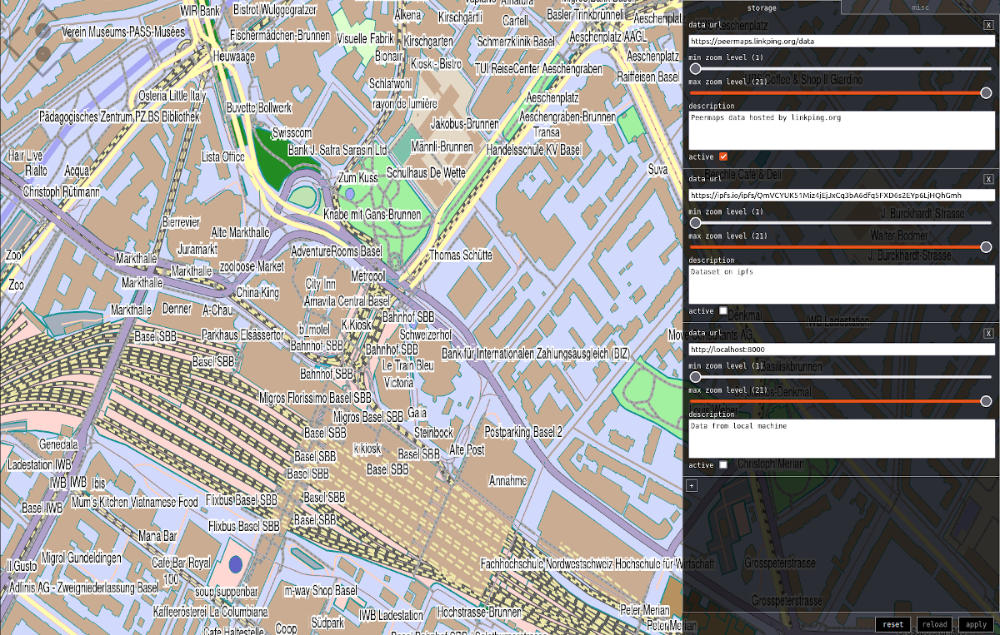

# peermaps-web

> Map web application for peermaps



## usage

Get the code, install and run:

```
$ git clone https://github.com/peermaps/peermaps-web.git
$ cd peermaps-web
$ npm install
$ npm start
```

Open the browser at `http://localhost:9966`.

## build

Running `npm run build` will result in a `public/` folder with static content that you can serve with a web server of your choice.

## settings

### via `config.json`

Settings can be configured by providing a `config.json` file with the following default values taken from `config.default.json`:

```json
{
  "bbox": [7.56,47.55,7.58,47.56],
  "style": {
    "url": "style.png"
  },
  "settings": {
    "storage": {
      "storages": [
        {
          "url": "https://peermaps.linkping.org/data",
          "description": "Peermaps data hosted by linkping.org",
          "zoom": [1, 21],
          "active": true
        },
        {
          "url": "https://ipfs.io/ipfs/QmVCYUK51Miz4jEjJxCq3bA6dfq5FXD6s2EYp6LjHQhGmh",
          "description": "Dataset on ipfs",
          "zoom": [1, 21],
          "active": false
        },
        {
          "url": "http://localhost:8000",
          "description": "Data from local machine",
          "zoom": [1, 21],
          "active": false
        }
      ]
    }
  }
}
```

If you want to run your own version of `peermaps-web` with a different configuration, you can copy `config.default.json` to `config.json` before running `npm run build` or `npm start`.

### via url search parameters

The following settings can be set via url search parameters:

* `data` (string) url to data source, defaults to `https://peermaps.linkping.org/data` (taken from the first active url in `settings.storages` matching the current zoom level)
* `bbox` (comma separated string `'minx,miny,maxx,maxy'`) view bounding box, defaults to `'7.56,47.55,7.58,47.56'` (taken from `settings.bbox`)
* `style` (string) url to shader style png, defaults to `style.png` (taken from `settings.style.url`)

**Example** `http://localhost:9966/#data=http://localhost:8000` would set the `data` source to `http://localhost:8000`.

## license

bsd
